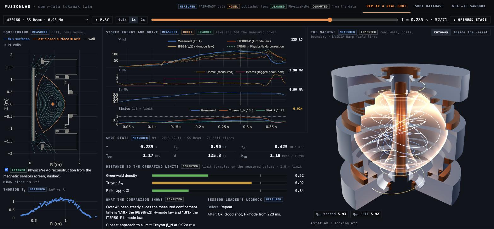
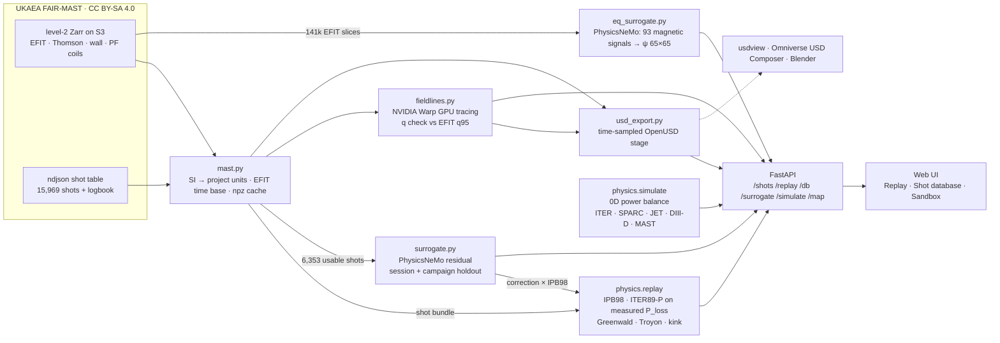
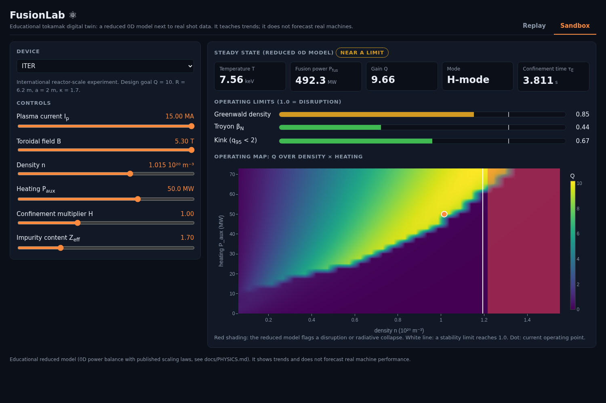

# FusionLab ⚛️

**An open-data tokamak digital twin.** Replay real shots of the UK's MAST tokamak beside a physics model, see where the
model is wrong, learn a correction with **NVIDIA PhysicsNeMo** and report its error honestly, trace the magnetic field
lines on the GPU with **NVIDIA Warp**, and take the shot away as a time-sampled **OpenUSD** stage.
Runs on one workstation, offline, from a clone.



> FusionLab is an educational and exploratory twin built on a reduced (0D) model.
> It compares with the experiment; it does not predict it.

## Why

NVIDIA's fusion twins with General Atomics (DIII-D), CFS/Siemens (SPARC) and UKAEA follow one pattern: measured data,
AI surrogates, an Omniverse/OpenUSD scene. They are closed and were built on national-lab machines. FusionLab is that
pattern on **open data** (UKAEA's FAIR-MAST archive, 15,969 shots). A researcher gets `load_shot(30166)` instead of a
week of plumbing; a student gets a real discharge to scrub through and watch hit a real limit.

## What's in it

| | |
|---|---|
| **Replay a real shot** | One screen: EFIT flux surfaces inside the real vessel, Thomson T_e profile, stored energy against the IPB98(y,2) and ITER89-P scaling laws fed the *measured* power, live Greenwald / Troyon / kink gauges, the session leader's logbook note, and a three.js vessel view with Warp-traced field lines. |
| **Shot database** | 6,353 real shots against IPB98(y,2), with the learned correction's holdout table beside it. |
| **What-if sandbox** | 0D power balance on ITER, a SPARC-class design, JET, DIII-D and MAST: move a slider, watch Q, the limits and the operating map. |
| **Equilibrium surrogate** | A PhysicsNeMo network reconstructs the flux map ψ(R,Z) from 93 magnetic signals; shown dashed over EFIT's surfaces with the per-slice error. |
| **OpenUSD export** | Each shot as a time-sampled stage: real vessel, PF coils, plasma boundary, field lines. OpenUSD export (Omniverse-compatible); opens in usdview, USD Composer or Blender. |
| **Python loader** | `mast.load_shot()` and a cleaned shot table, in consistent units on one time base. |

Every panel in the UI is tagged **measured / model / learned / computed**, so data is never mistaken for model.

## Quick start

Requires Python 3.11–3.12 and [uv](https://docs.astral.sh/uv/). Linux, macOS or Windows. An NVIDIA GPU is optional.
The repo ships the data cache and the trained models, so nothing needs the network or an API key.

```bash
make setup        # uv sync: numpy, torch, nvidia-physicsnemo, usd-core, zarr, s3fs, fastapi
make dev          # http://localhost:8000
```

Other commands: `make test` · `make train` (retrain the correction, rewrites its metrics) · `make bench` ·
`make usd` (OpenUSD export to `out/`) · `make fieldlines` (Warp q check + benchmark) ·
`make data` (re-download the FAIR-MAST cache).

```python
from fusionlab import mast
from fusionlab.physics import replay

s = mast.load_shot(30166)     # dict of arrays on the EFIT time base, in MA, T, 1e20 m^-3, keV, MW, MJ
r = replay(s)                 # IPB98 / ITER89-P on measured P_loss, H98(t), Greenwald / Troyon / kink fractions
db = mast.clean_db(mast.load_db())   # 6,353 shots at peak current
```

`uv run python scripts/fetch_mast.py 29182` caches any other level-2 shot (~27 s, ~1 MB).

## A five-minute demo

1. **Replay tab.** Shot **#30166** loads. Read the logbook note ("H-mode from 223 ms"), press **▶ Play**, and watch the
   flux surfaces, Thomson profile, gauges and 3D vessel move together. The measured stored energy leaves the L-mode law
   and joins the H-mode law.
2. Pick **#27257** (held out of all training): the PhysicsNeMo flux surfaces (green, dashed) lie on EFIT's (blue).
3. **Vessel view:** field lines traced by Warp inside the real vessel, traced q95 next to EFIT's. Drag to rotate;
   **Inside the vessel** puts the camera in the tank.
4. Pick **#30192**: the Troyon gauge turns red before the shot ends, and the logbook says why.
5. **Shot database tab:** this shot among 6,353, the holdout table, and the exponent caveat.
6. **OpenUSD stage** in the toolbar downloads the shot; open it in usdview, Omniverse USD Composer or Blender.
7. **Sandbox tab:** push ITER's density past the Greenwald limit and watch the operating map.

## What it found on real data

Every number comes from code in this repo. Full list, tables and caveats: [`docs/RESULTS.md`](docs/RESULTS.md).

- **The scaling laws land close on real discharges**: H89 ≈ 1.15 on ohmic shot 30420, H98 ≈ 1.16 on beam-heated 30166
  after its logged H-mode transition.
- **Three of the five cached shots run above the Troyon β_N limit before they end.** The 0D limits flag the
  neighbourhood, not the cause.
- **The learned correction helps where it has seen data and does not extrapolate.** On unseen sessions it has 28% less
  error than a refit power law; on an unseen campaign, 10% *more*. A random train/test split would have shown ~40% better.
- **Magnetics → flux map:** 1.65% median error on 176 shots from unseen sessions, against 2.64% for ridge regression.
  Feeding it EFIT's own fitted I_p cuts the error 5×, which is a leak, so we don't.
- **Warp field lines reproduce EFIT's safety factor** to a median 0.11–0.22% on all 209 slices, with no fitted factor.


## Architecture

| Layer | Tech |
|---|---|
| Data | UKAEA **FAIR-MAST**: level-2 Zarr on S3 (`zarr`, `s3fs`) + ndjson shot table; cached as `.npz` |
| Physics | Python + NumPy, vectorized: 0D power balance (sandbox), scaling laws on measured P_loss (replay). Sources in [`docs/PHYSICS.md`](docs/PHYSICS.md) |
| Learning | NVIDIA **PhysicsNeMo** `FullyConnected` on PyTorch/CUDA: τ_E correction, and the equilibrium surrogate |
| Field lines | NVIDIA **Warp** kernel: RK4 through the EFIT flux map, one GPU thread per line |
| Twin export | **OpenUSD** (`usd-core`): real vessel + PF coils, time-sampled plasma and field lines |
| API / UI | FastAPI + Uvicorn; static HTML/JS with Plotly and three.js vendored. No build step, works offline |





## Performance

Measured with `make bench` and `make fieldlines` on an AMD Threadripper 3990X + NVIDIA RTX 3090; full tables in
[`docs/RESULTS.md`](docs/RESULTS.md#performance).

| Task | Time | Throughput / note |
|---|---|---|
| Replay of a real shot (71 EFIT slices), vectorized | 0.11 ms | 627,247 slices/s, 56x faster than one call per slice |
| PhysicsNeMo correction, RTX 3090 (1,016,480 rows) | 5.86 ms | 173,528,297 rows/s |
| Warp: 4,096 field lines × 20 turns × 256 RK4 steps, RTX 3090 | 15.4 ms | 1.36 × 10⁹ steps/s |
| Load a cached shot (npz, no network) | 7.0 ms | first fetch from S3: ~27 s |

## Data & licence

MAST spherical tokamak (UKAEA, campaigns M5–M9, 2004–2013) from the open **FAIR-MAST** archive, https://mastapp.site,
licence **CC BY-SA 4.0**. The files under [`data/`](data/README.md) are derived from it and carry the same licence;
`data/README.md` lists exactly what we changed. No synthetic training data is used. Please cite Jackson et al.,
*SoftwareX* 27 (2024) 101869, doi:10.1016/j.softx.2024.101869, and Jackson et al., *IEEE Trans. Plasma Sci.* (2025),
doi:10.1109/TPS.2025.3583419.

Code: MIT.

## Limitations

- Reduced model: 0D, steady-state scaling laws. Compared with MAST data, not validated against it, and not predictive.
- The learned correction is trained on one point per shot; it improves 3 of the 5 showcase shots and worsens 2, and the
  app prints the per-shot error both ways.
- The equilibrium surrogate learns EFIT's answer; it does not check it. Field lines are those of EFIT's axisymmetric
  reconstruction: no islands, no 3D fields.
- Omniverse: we ship an OpenUSD export (Omniverse-compatible). We have not opened it in an Omniverse Kit app yet.

The full list and next steps are in [`docs/RESULTS.md`](docs/RESULTS.md#known-limitations--next-steps).

## Credit

[fusionsimulator.io](https://fusionsimulator.io) (Daniel Burgess, Columbia Fusion Research Center) was our reference
for what a clear fusion UI feels like. We copied no code, shaders, geometry or assets from it; how the two projects
differ is in [`docs/PRIOR_ART.md`](docs/PRIOR_ART.md).
