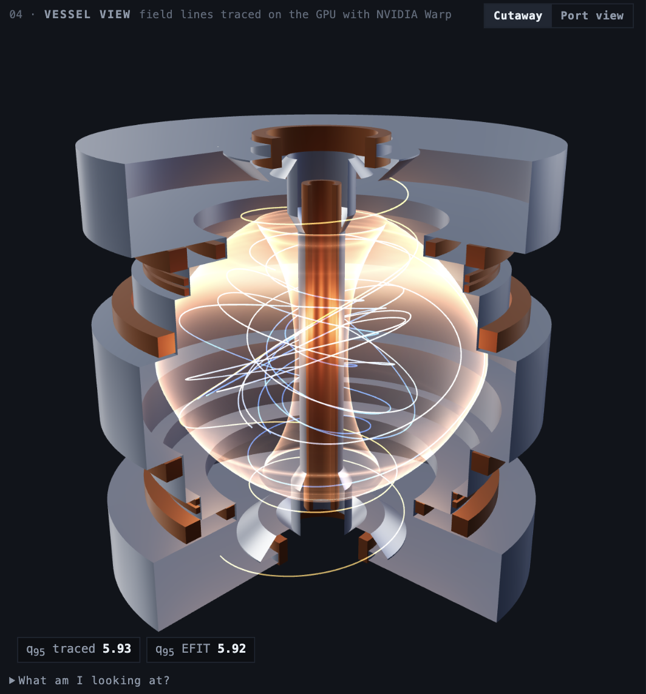

# Results, benchmarks and limitations

The detail behind the [README](../README.md). It is an educational twin on a reduced (0D) model: it compares with the
experiment and does not predict it.

## What it found on real data

Every number below comes from code in this repo (`make train`, `make bench`, the Replay tab).

1. **The scaling laws land close on real discharges.** Ohmic shot 30420 follows the ITER89-P L-mode law (H89 ≈ 1.15).
   Beam-heated shot 30166 sits on IPB98(y,2) after its logged H-mode transition (H98 ≈ 1.16).
2. **Three of the five cached shots run above the Troyon β_N limit before they end.** β_N/3.5 peaks at 1.15
   on 30192, 1.04 on 27257 and 1.03 on 29823. The logbooks blame locked modes (30192, 29823) and a tearing mode (27257);
   the 0D limits can flag the neighbourhood, not the cause.
3. **The Martin L–H threshold is far too low for MAST.** It gives 0.1–0.3 MW; the ohmic shot loses ~1 MW and stays on
   the L-mode law. So the replay shows both laws and never picks the mode from Martin.
4. **A learned correction helps inside the campaigns it saw and does not extrapolate to a new one.** See the table below.
5. **A random train/test split would have lied.** MAST sessions repeat near-identical shots. Split at random, the network
   looked ~40% better than a refit power law. Split by session it is 28% better; on an unseen campaign it is 10% *worse*.
6. **The B_T exponent cannot be read off routine operation.** 90% of shots lie in 0.40–0.50 T. Our refit gives
   B_T^−0.86 ± 0.11 against +1.4 from Valovič's dedicated scan (2009). A shot archive is not a designed experiment.
7. **Field lines traced with NVIDIA Warp reproduce EFIT's safety factor.** We integrate field lines through the EFIT
   flux map on the GPU and count toroidal turns per poloidal turn. Without using EFIT's own q, the traced q at
   ψ_N = 0.95 matches EFIT's q95 to a median 0.11–0.22% (95th percentile ≤ 0.51%) on all 209 slices of the four cached
   shots, with no fitted factor. That checks the whole chain: archive → units → interpolation → integrator.
   Source: `models/fieldlines_check.json`.
8. **A PhysicsNeMo network reconstructs the flux map from the magnetic sensors alone.** 93 signals (field probes, flux
   loops, coil currents, Rogowski I_p) → ψ(R,Z) on EFIT's 65×65 grid: 1.65% median error on 176 shots from unseen
   sessions, against 2.64% for ridge regression, with the magnetic axis within 1.2 cm (median). Feeding it EFIT's own
   fitted I_p instead of the measured one cuts the error 5×, which is a leak, so we don't. Table below.
9. **A trap in the archive:** the level-2 array named `wmhd` is the diamagnetic energy, ~3.5× the MHD stored energy.
   `plasma_energy` is the right one (it reproduces the logged value exactly). Guarded by a test.

### Learned correction: holdout error

Target: ln(τ_E measured / τ_E IPB98), 6,353 usable shots, one row per shot at peak current.
Model: `physicsnemo.models.mlp.FullyConnected` (8-32-32-1, 1,377 parameters), trained in ~3 s on an RTX 3090.
RMSE of ln τ_E (0.10 ≈ 10% scatter). Source: `models/surrogate_metrics.json`.

| Model | Unseen sessions (790 shots) | Unseen campaign M9 (716 shots) |
|---|---|---|
| IPB98(y,2) as published | 0.789 | 0.675 |
| IPB98(y,2) × one fitted constant | 0.685 | 0.691 |
| Refit power law | 0.528 | 0.536 |
| Refit power law + beam fraction (same inputs as the network) | 0.451 | **0.489** |
| IPB98 × PhysicsNeMo correction | **0.326** | 0.540 |

The scatter is large everywhere because the target is one time point per shot and the stored energy includes beam fast ions.
The sessions of all five shots shown in the app were held out of training.

### Equilibrium surrogate (magnetics → ψ): holdout error

`physicsnemo.models.mlp.FullyConnected` (93 → 4×512 → 64 PCA coefficients of ψ → 65×65, 868,928 parameters), trained in
28 s on one RTX 3090 on 1,429 M8+M9 shots (115,611 EFIT slices). Split by session block, never by time slice.
Test set: 176 shots, 12,662 slices. Source: `models/eq_surrogate_metrics.json` (with ablations and caveats).

| Model | Relative L2 error of ψ, median / p95 | Magnetic-axis error, median / p95 |
|---|---|---|
| Training-set mean ψ | 43.4% / 195% | 8.97 / 25.0 cm |
| Ridge regression (λ chosen on validation) | 2.64% / 9.74% | 2.16 / 12.35 cm |
| PhysicsNeMo MLP | **1.65% / 5.93%** | **1.21 / 5.09 cm** |

Inference: 3.48 million slices/s at batch 4,096, 0.32 ms for one slice (RTX 3090). We cannot run EFIT here, so there is no
speed-up claim. This is a surrogate of EFIT's reconstruction: it learns EFIT's answer and does not check it. In the app,
shot #27257 is from the held-out sessions (0.97% median over the shot); the other four were in the training sessions and say so.

## Performance

Output of `make bench` on this machine (AMD Threadripper 3990X, NVIDIA RTX 3090). Measured, not estimated.

| Task | Time | Throughput / note |
|---|---|---|
| Replay of a real shot (71 EFIT slices), vectorized | 0.11 ms | 627,247 slices/s |
| same, one call per slice (reference) | 6.33 ms | 56x slower |
| Load a cached shot (npz, no network) | 7.0 ms | first fetch from S3: ~27 s |
| IPB98(y,2) on the shot table (6,353 shots) | 0.64 ms | 9,858,569 shots/s |
| PhysicsNeMo correction, CPU (6,353 rows) | 0.47 ms | 13,422,180 rows/s |
| PhysicsNeMo correction, NVIDIA GeForce RTX 3090 (1,016,480 rows) | 5.86 ms | 173,528,297 rows/s |
| Sandbox operating map 30x30 (0D power-balance solve per point) | 295 ms | 3,047 points/s |
| Sandbox operating map 100x100 (0D power-balance solve per point) | 3302 ms | 3,029 points/s |

NVIDIA Warp field-line tracing (`make fieldlines`, numbers in `models/fieldlines_check.json`):

| Task | Time | Throughput / note |
|---|---|---|
| 4,096 field lines × 20 turns × 256 RK4 steps, full trajectory stored, RTX 3090 | 15.4 ms | 1.36 × 10⁹ steps/s |
| 65,536 lines × 20 turns × 256 steps, every 16th point stored, RTX 3090 | 45.3 ms | 7.4 × 10⁹ steps/s |
| same kernel on Warp's single-threaded CPU device (256 lines) | 291 ms | 4.5 × 10⁶ steps/s |
| q check of a whole shot (71 slices, ≥12 poloidal transits each), one launch | 0.21 s | median error 0.22% vs EFIT q95 |
| first launch in a fresh process, kernel cache warm / cold | 0.22 s / 2.6 s | kernel build included |

Also measured: the whole 15,969-shot table downloads in one request in ~7 s; `/replay/{id}` answers in ~40 ms;
the OpenUSD export of a 71-slice shot with field lines takes ~0.4 s (6.6 MB `.usdc`).

## Known limitations & next steps

**Limitations**
- Reduced model: 0D, steady-state scaling laws. Compared with MAST data, not validated against it, and not predictive.
- EFIT stored energy includes beam fast ions, so H98 reads high in beam-heated phases. Replay feeds line-average density
  where the laws want it and the engine wants volume-average. T_i = T_e is assumed.
- Level 2 has no beam-power trace: NBI is a box at the logged peak power between the logged start and end times.
- Spitzer ohmic power without the neoclassical correction comes out ~5× below the measured P_ohm at MAST's aspect ratio.
- The learned correction was trained on one point per shot and is applied to whole discharges. It improves 3 of the 5
  showcase shots and worsens 2; the app prints the per-shot error both ways.
- The equilibrium surrogate learns EFIT's answer from a subset of what EFIT was given. About a third of its squared
  error is a uniform ψ offset, which does not change B. Its test set is 4 session blocks, so the numbers move with the seed.
- Field lines are those of EFIT's axisymmetric reconstruction: no islands, no 3D or error fields. Matching EFIT's q
  shows our numerics are right, not that EFIT is.
- Omniverse: we ship an OpenUSD export (Omniverse-compatible). We have not opened it in an Omniverse Kit app yet.
- FAIR-MAST warns that its API may change; the committed cache keeps the demo independent of it.

**Next steps**
1. Omniverse Kit app on the RTX 3090s: load the time-sampled stage, stream it, update attributes live from the API.
2. Feed the equilibrium surrogate's ψ to the Warp tracer, so field lines and q come straight from the probes in under a millisecond.
   Warp next: connection length and strike-point maps on the divertor from millions of scrape-off-layer lines.
3. TORAX as the 1D model in the "model" slot, driven by the same shot bundles.
4. Time-resolved training data (every steady slice, thermal energy only) to fix the transfer problem in limitation 5.
5. Missions written on real shots ("why did 30420 miss its density target?").
